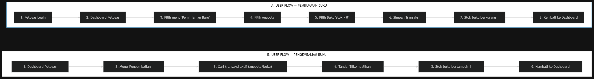

# SIMPUS-Mini
## Wireframe & User Flow — Sistem Informasi Perpustakaan

> **Sub-CPMK:** Merancang UI/UX aplikasi (proyek).  
> **Catatan:** Halaman yang sudah ada (*Beranda, Daftar/Tambah Buku, Daftar/Tambah Anggota — Jobsheet 1-3*) belum mencakup fitur Login, Dashboard Petugas, dan Peminjaman/Pengembalian. Dokumen ini merancang wireframe untuk halaman-halaman tersebut sebelum diimplementasikan mulai Jobsheet 5 dan seterusnya.

---

## 1. Aktor Sistem

### 👤 1. Tamu (Pengunjung Publik)
- Hanya bisa melihat katalog buku (*Beranda*, *Daftar Buku*).
- Tidak perlu melakukan login.

### 👨‍💼 2. Petugas (Administrator Perpustakaan)
- Login untuk mengakses seluruh fitur administrasi.
- Mengelola data buku (CRUD Buku).
- Mengelola data anggota (CRUD Anggota).
- Melakukan transaksi **Peminjaman Buku**.
- Melakukan transaksi **Pengembalian Buku**.

---

## 2. User Flow



---

## 3. Wireframe Halaman (Struktur UI Teks)

### 3.1. Halaman Login (`login.html` / `login.php`)

```text
+-------------------------------------------------------------+
|                         SIMPUS-Mini                         |
|                        Login Petugas                        |
|                                                             |
|   Username : [ Masukkan username                          ] |
|   Password : [ Masukkan password                          ] |
|                                                             |
|              [           MASUK           ]                  |
|                                                             |
|              Belum punya akun? Daftar di sini               |
+-------------------------------------------------------------+
```

### 3.2. Dashboard Petugas (`dashboard.html` / `dashboard.php`)

```text
+-----------------------------------------------------------------------------------+
| SIMPUS-Mini   [Beranda]  [Buku]  [Anggota]  [Peminjaman]        Petugas | [Logout]|
+-----------------------------------------------------------------------------------+
|                                                                                   |
|  +--------------------+   +--------------------+   +--------------------+         |
|  |     Total Buku     |   |   Total Anggota    |   |   Sedang Dipinjam  |         |
|  |        120         |   |         85         |   |         15         |         |
|  +--------------------+   +--------------------+   +--------------------+         |
|                                                                                   |
|  Aksi Cepat:                                                                      |
|  [ + Peminjaman Baru ]    [ + Pengembalian ]                                      |
|                                                                                   |
|  Transaksi Terbaru:                                                               |
|  +-----------------------------------------------------------------------------+  |
|  | Anggota        | Buku              | Tgl Pinjam   | Status                  |  |
|  +----------------+-------------------+--------------+-------------------------+  |
|  | Siti Aminah    | Laskar Pelangi    | 20/05/2024   | [ Dipinjam ]            |  |
|  | Budi Santoso   | Bumi Manusia      | 19/05/2024   | [ Dipinjam ]            |  |
|  | Dewi Lestari   | Negeri 5 Menara   | 18/05/2024   | [ Dikembalikan ]        |  |
|  +-----------------------------------------------------------------------------+  |
|  Lihat semua transaksi ->                                                         |
+-----------------------------------------------------------------------------------+
```

### 3.3. Form Peminjaman (`peminjaman/tambah.html`)

```text
+-------------------------------------------------------------+
| Form Peminjaman Buku                                        |
|                                                             |
| Anggota                                                     |
| [ -- Pilih Anggota --                                     v ] |
|                                                             |
| Buku                                                        |
| [ -- Pilih Buku (stok > 0) --                             v ] |
|                                                             |
| Tanggal Pinjam                                              |
| [ 22/05/2024                                             📅 ] |
| *(Otomatis: hari ini)                                       |
|                                                             |
| [                    Simpan Peminjaman                    ] |
+-------------------------------------------------------------+
```

### 3.4. Form Pengembalian (`pengembalian/index.html`)

```text
+-----------------------------------------------------------------------------------+
| Pengembalian Buku                                                                 |
| Cari transaksi aktif:                                                             |
| [ Nama anggota / judul buku...                                                  🔍] |
|                                                                                   |
| +-------------------------------------------------------------------------------+ |
| | Anggota        | Buku             | Tgl Pinjam   | Aksi                       | |
| +----------------+------------------+--------------+----------------------------+ |
| | Siti Aminah    | Bumi Manusia     | 15/05/2024   | [ Kembalikan ]             | |
| | Budi Santoso   | Laskar Pelangi   | 18/05/2024   | [ Kembalikan ]             | |
| | Dewi Lestari   | Negeri 5 Menara  | 19/05/2024   | [ Kembalikan ]             | |
| +-------------------------------------------------------------------------------+ |
+-----------------------------------------------------------------------------------+
```

### 3.5. Riwayat Peminjaman per Anggota (`peminjaman/riwayat.html`)

```text
+-----------------------------------------------------------------------------------+
| Riwayat Peminjaman — Siti Aminah                                                  |
|                                                                                   |
| +-------------------------------------------------------------------------------+ |
| | Buku              | Pinjam       | Kembali      | Status                      | |
| +-------------------+--------------+--------------+-----------------------------+ |
| | Laskar Pelangi    | 01/07/2024   | 10/07/2024   | [ Selesai ]                 | |
| | Bumi Manusia      | 15/07/2024   | -            | [ Dipinjam ]                | |
| | Negeri 5 Menara   | 20/06/2024   | 28/06/2024   | [ Selesai ]                 | |
| | Pulang            | 05/06/2024   | 12/06/2024   | [ Selesai ]                 | |
| +-------------------------------------------------------------------------------+ |
|                                                                                   |
| Keterangan Status:  🟡 Dipinjam    🟢 Selesai    ⚪ Dikembalikan                  |
+-----------------------------------------------------------------------------------+
```

---

## 4. Konsistensi Desain

1. **Gaya Desain & CSS:**
   - Warna aksen, tipografi navbar, dan gaya tabel/kartu mengikuti `assets/css/style.css` yang sudah dibangun sejak Jobsheet 2–3.
2. **Navigasi Dinamis:**
   - Navbar akan ditambah menu *Peminjaman* dan indikator status login (*Nama Petugas / Tombol Logout*) mulai implementasi di Jobsheet 10 / backend.
3. **Komponen UI Terstandar:**
   - Komponen UI (tabel, tombol aksi, form field, status badge, stat card) konsisten dengan desain yang sudah berjalan untuk menjaga pengalaman pengguna yang seragam.
4. **Tipografi:**
   - Tipografi yang digunakan tetap mengikuti style yang ada agar tampilan antarmuka tetap selaras, modern, dan profesional.

---

## 5. Validasi & Edge Cases

- ✅ **Validasi Stok Kosong:** Buku dengan stok `0` tidak boleh dipilih pada form peminjaman.
- ⚠️ **Validasi Tunggakan Anggota:** Anggota dengan tunggakan/keterlambatan buku divalidasi saat peminjaman (implementasi di Jobsheet 12).
- 🔄 **Otomasi Stok:** Stok buku otomatis berkurang saat transaksi peminjaman berhasil, dan otomatis bertambah saat pengembalian dilakukan.
- 📄 **Validasi Status Transaksi:** Transaksi hanya dapat dikembalikan jika status transaksi masih `"Dipinjam"`.
- 🔒 **Hak Akses & Keamanan:** Hanya petugas yang sudah login yang dapat mengakses dashboard, fitur CRUD, dan transaksi perpustakaan.

---

> 💡 **Catatan Penutup:** Seluruh wireframe dan alur ini merupakan dokumen rancangan antarmuka & arsitektur sistem. Implementasi teknis akan mulai dikerjakan pada **Jobsheet 5 dan seterusnya**.
